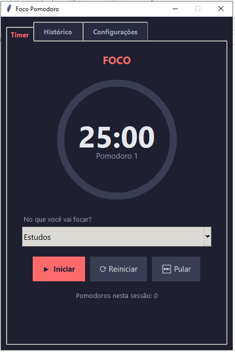
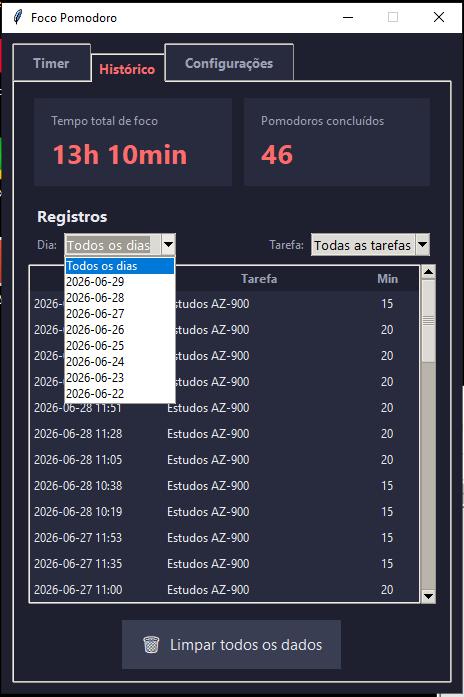
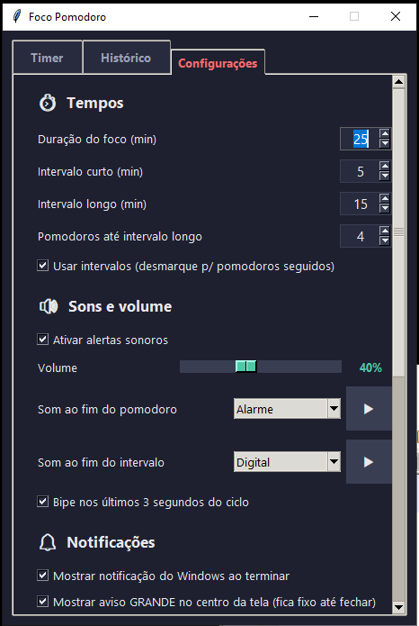
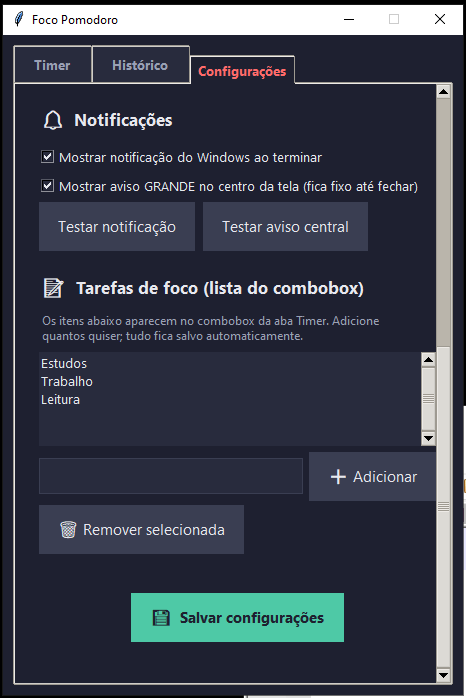

# 🍅 Foco Pomodoro

Um timer **Pomodoro** visual feito em Python para ajudar você a **gerenciar o tempo
e manter o foco** nos estudos e no trabalho. Interface em tema escuro, com anel de
progresso circular, histórico das suas sessões, alertas sonoros e notificações.



---

## O que é a Técnica Pomodoro?

A **Técnica Pomodoro** é um método de gestão de tempo criado por Francesco Cirillo
no fim dos anos 1980. O nome vem do timer de cozinha em formato de tomate
(*pomodoro*, em italiano) que ele usava.

A ideia é simples: em vez de trabalhar por horas a fio e se esgotar, você divide o
trabalho em blocos curtos e focados, separados por pequenas pausas. Cada bloco de
foco é um **"pomodoro"**.

O ciclo funciona assim:

1. **Escolha uma tarefa** em que vai se concentrar.
2. **Foque por 25 minutos** (1 pomodoro), sem distrações.
3. Ao terminar, faça um **intervalo curto de ~5 minutos** para descansar.
4. A cada **4 pomodoros**, faça um **intervalo longo de ~15 minutos**.
5. Repita.

**Por que funciona?**

- Trabalhar contra um relógio cria um senso de urgência saudável e reduz a
  procrastinação.
- Os intervalos regulares evitam a fadiga mental e ajudam a manter a concentração
  ao longo do dia.
- Contar pomodoros concluídos dá uma noção concreta de quanto você produziu — e é
  motivador ver o número crescer.

O **Foco Pomodoro** automatiza todo esse ciclo para você: conta o tempo, avisa a
hora de descansar, alterna entre foco e intervalos e ainda guarda o histórico do
seu progresso.

---

## Para que serve este aplicativo

- **Gerenciar seu tempo de estudo/trabalho** em blocos focados.
- **Não perder a hora** de descansar nem de voltar ao foco (com som + notificação).
- **Acompanhar seu progresso**: quanto tempo total você focou e quantos pomodoros
  concluiu, com filtros por dia e por tarefa.
- **Adaptar a técnica ao seu ritmo**: você ajusta as durações, os sons e o
  comportamento das pausas como preferir.

---

## Como usar

Não precisa instalar nada além do Python: o app usa apenas a biblioteca padrão
(`tkinter`).

- **Duplo clique** no atalho **`_FocoPomodo_INICIAR`** (ícone de tomate), ou
- No terminal, dentro desta pasta:
  ```
  python foco_pomodoro.py
  ```

### Passo a passo

1. Abra o app na aba **Timer**.
2. No campo **"No que você vai focar?"**, escolha uma tarefa (Estudos, Trabalho,
   Leitura...). Você pode cadastrar suas próprias tarefas na aba *Configurações*.
3. Clique em **▶ Iniciar**. O anel começa a contar 25 minutos (ou o tempo que você
   configurou).
4. Quando o pomodoro termina, o app **avisa** (som, notificação e/ou aviso central)
   e **emenda automaticamente** o intervalo. Ao fim do intervalo, ele volta sozinho
   ao foco.
5. Acompanhe quantos pomodoros já fez no rodapé ("Pomodoros nesta sessão").

### Controles do timer

| Botão | Função |
|-------|--------|
| ▶ Iniciar / ⏸ Pausar | Liga e pausa a contagem |
| ⟳ Reiniciar | Volta o ciclo atual ao tempo cheio |
| ⏭ Pular | Avança para o próximo ciclo |

A janela abre **centralizada**, em **tamanho fixo** e **sem botão de maximizar**.

### Atalho com ícone

O atalho `_FocoPomodo_INICIAR.lnk` abre o app sem janela de console e usa o
ícone `foco.ico` (um tomate nas cores do tema). Se você mover a pasta para
outro lugar, recrie o atalho com:

```
python criar_atalho.py
```

Você pode copiar/fixar esse atalho na Área de Trabalho, na barra de tarefas
ou no menu Iniciar.

---

## As telas do aplicativo

### Timer

A tela principal: o anel de progresso circular mostra o tempo restante, o estado
atual (**FOCO**, **INTERVALO** ou **INTERVALO LONGO**) e em qual pomodoro você está.
Abaixo, escolha a tarefa e use os botões de controle.


### Histórico

Mostra o **tempo total de foco** e a **quantidade de pomodoros concluídos**, além da
lista de todos os registros. Use os filtros **Dia** e **Tarefa** para ver, por
exemplo, quanto você estudou hoje ou quanto tempo dedicou a um assunto específico.



### Configurações

Aqui você adapta a técnica ao seu jeito:

**Tempos e sons:**



**Notificações e tarefas:**



---

## Recursos

- **Anel de progresso** circular com o tempo restante.
- **Descrição da tarefa**: antes de iniciar, escolha no que vai focar
  (Estudos, Trabalho, Leitura...). Isso fica salvo em cada registro.
- **Tempos configuráveis** na aba *Configurações*:
  - duração do foco;
  - intervalo curto e intervalo longo;
  - de quantos em quantos pomodoros ocorre o intervalo longo.
- **Sem intervalos**: desmarque "Usar intervalos" para emendar um pomodoro
  após o outro, sem pausa.
- **Histórico persistente** com filtros por dia e por tarefa: tempo total de foco,
  quantidade de pomodoros e a lista de registros.
- **Tarefas personalizadas**: cadastre, na aba *Configurações*, os itens que
  aparecem no campo de foco da aba *Timer*.
- **Alertas sonoros com volume próprio**:
  - 6 sons à escolha (Bipe simples, Bipe duplo, Sino, Alarme, Suave, Digital),
    com som separado para o fim do pomodoro e para o fim do intervalo;
  - **bipe nos últimos 3 segundos** de cada ciclo;
  - **controle de volume da própria aplicação** (0–100%), independente do
    volume do Windows — o som é sintetizado na amplitude escolhida;
  - botão ▶ para testar cada som.
- **Notificação do Windows 10/11** (toast) ao terminar cada ciclo, podendo
  ser ativada/desativada nas configurações (com botão de teste).
- **Aviso grande no centro da tela**: janela ampla, sempre por cima das outras
  aplicações, que fica **fixa até você clicar em Fechar**. Liga/desliga nas
  configurações (com botão de teste).
- **Limpar dados** a qualquer momento pelo botão na aba *Histórico*.

---

## Requisitos

- **Python 3** (testado no Windows 10/11).
- Apenas a biblioteca padrão — `tkinter` já vem incluído na maioria das instalações
  do Python. As notificações *toast* e o aviso central são recursos do Windows.

---

## Onde ficam os dados

Tudo é salvo em JSON nesta mesma pasta, então os dados se mantêm ao fechar
e abrir o programa:

- `config.json` — suas preferências de tempo, sons, notificações e a lista de tarefas.
- `historico.json` — todos os pomodoros concluídos.

Esses arquivos são criados automaticamente na primeira execução.

---

## Estrutura do projeto

| Arquivo | Função |
|---------|--------|
| `foco_pomodoro.py` | Aplicação principal e interface (tkinter) |
| `armazenamento.py` | Leitura/escrita do `config.json` e do `historico.json` |
| `sons.py` | Síntese e reprodução dos alertas sonoros |
| `notificacao.py` | Notificações *toast* do Windows |
| `criar_atalho.py` | Gera o atalho `.lnk` com ícone |
| `foco.ico` | Ícone do tomate |
</content>
</invoke>
